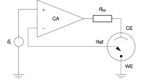
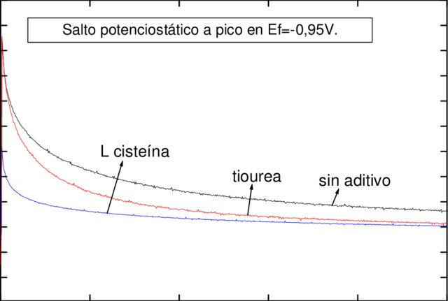
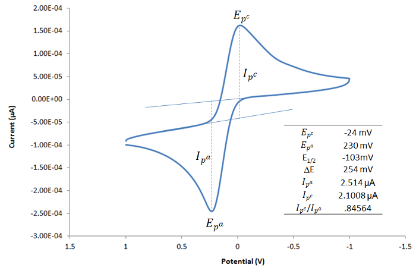
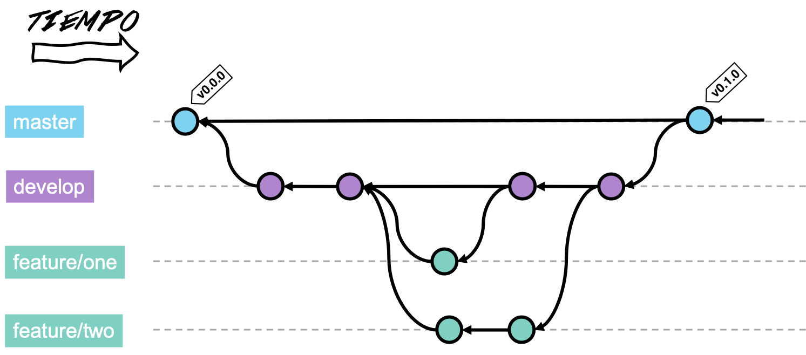
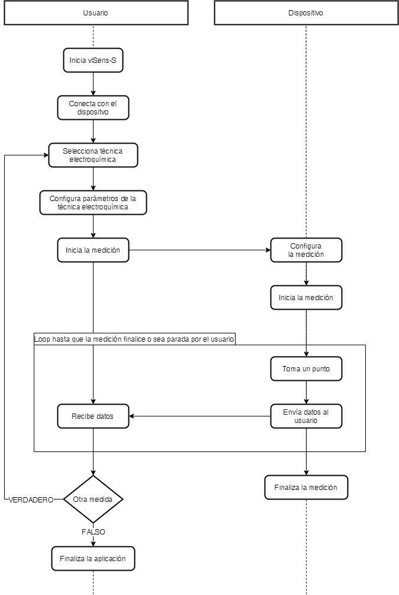
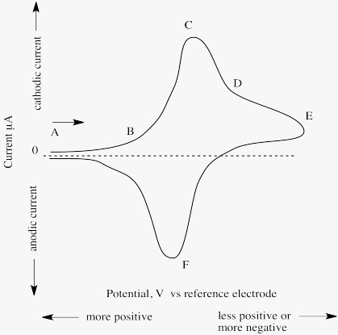
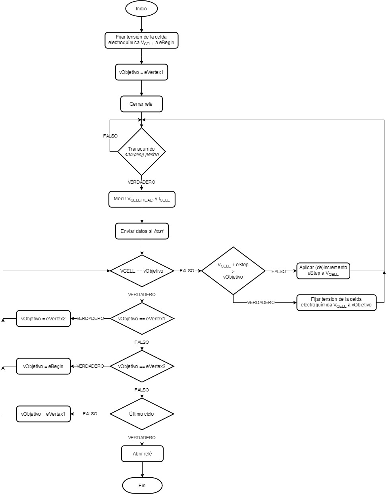
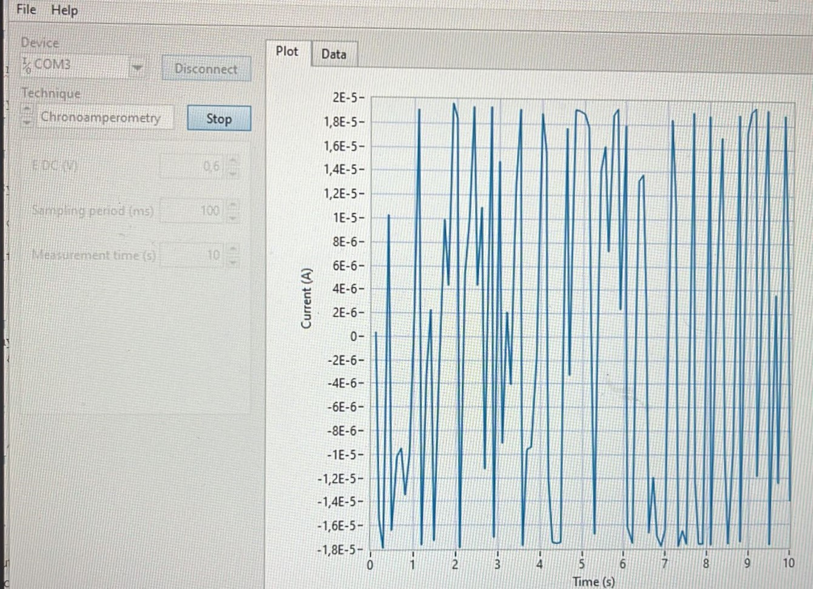
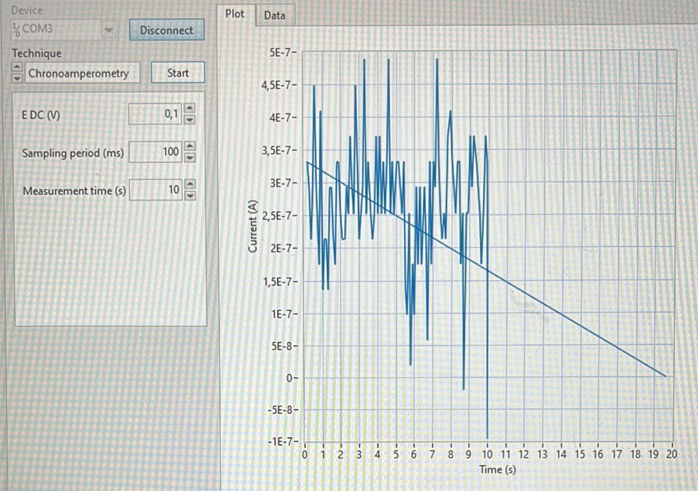
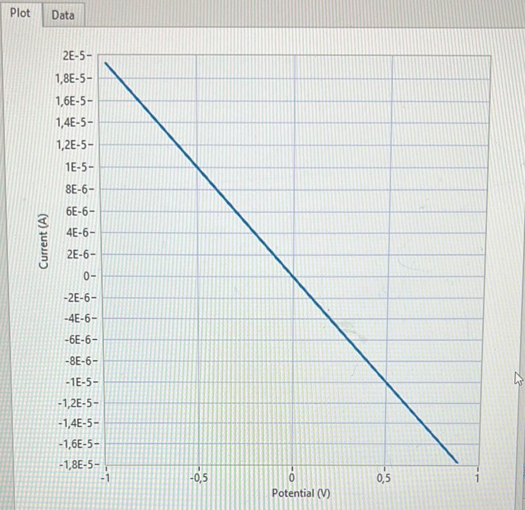

# **Final Project Microcontrollers: Potentiostat**

    

This project has been developed during the academic year 2022-2023 in the Degree in Biomedical Engineering of the University of Barcelona (UB) in the elective course Microcontrollers for Biomedical Applications and Systems. The project has been carried out by the group **_Biominds_** formed by Marc Florido, Isabel Martín and Adrià Pladevall, together with the tutoring during the project by Professor Albert Álvarez Caeulla, to whom we are grateful for his help in the work.

    
    
    

> **Figure 1: Marc Florido (left), Isabel Martín (center), and Adrià Pladevall (right), authors of the project developed.**

Attached below is all the information regarding the project developed, which consists of the programming of a potentiostat to carry out electrochemical measurements. All the results obtained during the project are included, as well as an explanation of how we have worked as a team to achieve the objectives using Git version control in different branches.

## **Table of contents**

- [Introduction](#introduction)
  - [Potentiostat](#potenciostat) 
  - [Chronoamperometry](#chronoamperometry) 
  - [Cyclic voltammetry](#cyclic-voltammetry) 
- [Objectives of the project](#objectives-of-the-project)
- [Software and Hardware](#software-and-hardware)
- [*Workflow* in Git](#workflow-in-git)
- [Methdology](#methodology)
  - [Organization](#organization)
  - [Application](#application)
  - [Microcontroller](#microcontroller)
  - [Chronoamperometry](#chronoamperometry)
  - [Cyclic voltammetry](#cylic-voltammetry)

- [Results](#results)
  - [Chronoamperometry results test](#chronoampeometry-results-test)
  - [Chronoamperometry results experimental](#chronoamperometry-results-experimental)
  - [Cyclic voltammetry results test](#cyclic-voltammetry-results-test)
  - [Cyclic voltammetry results experimental](#cyclic-voltammetry-results-experimental)

- [References](#references)

## Introduction
In this project, the programming of a potentiostat will be carried out. The potentiostat consists of two main components: a front-end designed specifically for this project and a back-end based on the Evaluation Board (EVB) NUCLEO-F401RE from _STMicroelectronics_. 

The main objective of the project is to achieve the capability to perform two types of electrochemical measurements: cyclic voltammetry and chronoamperometry. To validate the performance of the device, measurements will be carried out using a sample of potassium ferricyanide at different concentrations in a buffer or potassium chloride solution.

### **Potentiostat**
A potentiostat is an electronic instrument used in electrochemical studies to measure and control the voltage difference of a three-electrode cell.

The system functions by maintaining the working electrode potential (WE) at a constant level with respect to the reference electrode potential (RE) by adjusting the current at an auxiliary electrode (CE). This is an electrical cricuit, which is generally described in the form of simple Op Amps, as can be seen in Figure 2. The working electrode is where the electrochemical reaction takes place with which the reference electrode is able to measure the potential generated at the reference electrode. [1]

    

> **Figure 2: Diagram of a potentiostat.**

### **Chronoamperometry**
Chronoamperometry is an electrochemical technique that involves applying a step potential across the working electrode. This causes oxidation or reduction reactions in solution at the electrode, and the resulting electrochemical current is measured over time after the potential step is applied. [2]

In chronoamperometry, a square wave potential is applied to the working electrode and the resulting current is monitored as a function of time. The current fluctuates as the analyte diffuses from the bulk solution to the sensor surface. By studying the current-time dependence, chronoamperometry allows measurement of diffusion-controlled processes at an electrode that vary with analyte concentration. This technique is very sensitive and does not require labeling of the analyte or the bioreceptor. [3]

Chronoamperometry has been widely used in various studies, either independently or in combination with other electrochemical techniques such as cyclic voltammetry. For example, Martins et al. employed chronoamperometry to investigate the adsorption of human serum albumin on self-assembled monolayers (SAMs) on gold substrates. [2]

    

> __Figure 3: Chronoamperometry from the initial potential Ei to-0.95 V (peak area c 1 of the voltammetry), in the presence or absence of additive: a. without additive; b. with thiourea 5-10^-4 M; c. l-cysteine 5-10^-4 M. [4]__

### Cyclic voltammetry

Cyclic voltammetry is an essential method in electrochemistry for measuring the reduction potential of chemical species in solution. By applying a controlled voltage and recording the resulting current, information is obtained about the reduction/oxidation reactions and the stability of the species involved in electron transfer. This technique, also known as cyclic voltammetry (CV), allows catalysts and electrochemical compounds to be explored in greater depth. Its combination with modeling and systematic approaches saves time and is useful for researchers with limited access to electrochemical instrumentation. [5,6]

Cyclic voltammetry is an experiment that involves exploring a variety of voltages while measuring current. In this experiment, the potential of an electrode is varied from an initial to a final value and then the process is reversed. This generates a "cyclic" sweep of voltages and the graphical representation of current versus voltage is called a cyclic voltammogram. Voltammograms provide information on the stability of oxidation states, the reversibility of electron transfer reactions and the reactivity of species. This video explains the basic setup and shows a simple cyclic voltammetry experiment. [7]

    

> __Figure 4: Cyclic Voltammetry: Measurement of Redox Potentials and Currents. [7]__

## **Objectives of the project**

The main objective is to obtain concentration measurements in electrochemical samples using cyclic voltammetry and chronoamperometry techniques on potassium ferricyanide samples at different concentrations in a potassium chloride buffer, ensuring the correct programming and communication of the potentiostat using the STM-32 Core 64 board.

In addition, it has the secondary objective of controlling the power supply unit (PMU) of the potentiostat front-end module and communicating with the viSens-S application using the MASB-COMM-s protocol. Finally, they must meet specific requirements, such as startup and non-disablement of the PMU and asynchronous communication with the host.

## __Software and Hardware__

The programming of the microcontroller is of vital importance in the context of the project, as it plays a crucial role in the communication and control of the potentiostat, as well as in receiving and sending relevant instructions and data. To carry out this task, the STM32 Nucleo-F401RE board has been used. The programming of this microcontroller has been done using the STM32CubeIDE software, in C language.

The project has another _software_ component which is the _viSens-S_ application, which is available in a link. This application has the function to select the port where the board is connected, select the technique to be performed (chronoamperometry or cyclic voltammetry), choose different parameters, and send the necessary instructions to perform the measurements, and finally receive and visualize the corresponding data.

## __*Workflow* in Git__
Git is the world's most widely used Version Control System (VCS) for software development. This system allows tracking changes in the code and collaboration between different developers. This allows the recovery of previous versions Git allows the creation of branches to work individually without affecting the main branch.

In addition, we used GitHub which is a cloud-based software development platform that allows hosting, sharing and collaborating on repositories using the Git version control system. The platform allows developers to work as a team detecting changes and maintaining a version history. 

In Git, different branches are used to organize code development. The ``master`` branch is where the production code is located, that is, the code that is ready to be delivered to the customer and works correctly.

On the other hand, the ``develop`` branch is used as the main development branch. This is where all the developments made by the team are grouped together and the necessary tests are carried out. Once everything is verified to work correctly, the changes are merged into the `master` branch via a Pull Request to make them available to the client.

In addition, `feature/***` branches are used to work on the development of specific functionality. Each of these branches contains the individual or joint work related to a certain functionality. After these branches have been tested and verified to work correctly, they are merged into the ``develop`` branch via a Pull Request.

The repository will follow the branch tree shown in Figure 5.

    

> __Figure 5: Git Tree for this repository.__

## __Methodology
### __Organization__

This project has been organized in different `feature/***` branches, each one created with the objective of editing a specific part of the project, namely to create the different functions needed to implement chronoamperometry and voltammetry. 

The following branches were created: 

- `feature/PMU`: To create the PMU power off and power on functions. 
- `feature/adc`: To create the ADC start or stop functions to capture the voltage and current. 
- `feature/command_handler`: To edit everything related to the stm32main.c file. 
- `feature/rele`: To create the functions to open or close the relay. 
- `feature/timers`: To create the functions that start the timers and the ISR interrupt function that is executed when the measurement period has elapsed. 
- `feature/chronoamperometry`: To create the chronoamperometry function that will perform the measurement. 
- `feature/cyclic_voltammetry_correct`: To create the voltammetry function that will perform the measurement. 
- `feature/command_handler`: To develop the stm32main.c file that contains the setup and loop function to configure, initialize and handle commands received through MASB_COMM_S to execute a voltammetry or chronoamperometry.

### __Application__

> **Figure 6. Workflow of the application**

In the workflow implementation seen in Figure 6, key elements are required to facilitate asynchronous communication between a device and a desktop application. These elements include USART communication, COBS encoding and the MASB-COMM-S protocol.

Asynchronous communication via USART is crucial to establish a serial connection between the device and the desktop application. It allows data to be transmitted and received independently, which means that both the device and the application can send and receive information at any time without having to wait for an immediate response.

To ensure reliable and error-free communication, COBS coding is used. This technique encodes and decodes the information transmitted between the device and the application; as seen in previous practices of the Microcontrollers course.  

In addition, the MASB-COMM-S protocol is used, which plays an important role in the implementation. The cobs.c file is specifically in charge of encoding and decoding the information, while the masb_comm_s.c file is in charge of setting up the asynchronous communication. The latter is also responsible for receiving and reading measurement instructions, storing the corresponding parameters in the appropriate structures. It is also responsible for transmitting the data obtained.

### __Microcontrolador__

> **Figure 7. Workflow of the microcontroller**

The "stm32main.c" file contains the implementation of the "setup" and "loop" functions, which are called by the main file "main.c", the first file to be executed. These functions are dedicated to configure and control the device according to the commands received through asynchronous communication using the MASB-COMM-S protocol.

In the "setup" function, the following tasks are performed:

- A message is expected to be received using the "MASB_COMM_S_waitForMessage()" function.

- The I2C communication is initialized by calling the function "I2C_init()" and the object "hi2c1" representing the I2C controller is configured.
- The power management module (PMU) is turned on by calling the "Start_PMU()" function.
- The digital-to-analog converter (DAC) is initialized using the "MCP4725_Init()" function. Parameters such as slave address, reference voltage and write function are set.
- The digital potentiometer (AD5280) is initialized using the "AD5280_Init()" function. The slave address, resistance setpoint and write function are configured.
- The resistance of the potentiometer is set to 50 kOhm by calling "AD5280_SetWBResistance()".
- The initial state of the device is set to "IDLE".

In the "loop" function, the main loop of the program is performed. 

- First, it is checked whether a message has been received by calling the function "MASB_COMM_S_dataReceived()". If a message has been received, the received command is parsed using "MASB_COMM_S_command()". Depending on the received command ("START_CV_MEAS", "START_CA_MEAS" or "STOP_MEAS"), the device status ("CV", "CA", "IDLE") is updated and the corresponding settings are stored. This received status will depend on the measurement we want to make. If no message has been received, the code verifies the current status of the device. 
- If the status is "CV" (cyclic voltammetry) or "CA" (chronoamperometry), the functions "cyclic_voltammetry()" or "chronoamperometry()" respectively are executed, using the previously stored settings.

### __Chronoamperometry__

#### __Concept__

As discussed above, chronoamperometry is an electrochemical technique used to study redox reactions and measure the electrical current generated during these reactions as a function of time. It is based on the application of a constant potential across an electrochemical cell and the measurement of the resulting current as the reaction develops at the electrode.

The implementation of chronoamperometry is done in the file named "chronoamperometry.c". This function is responsible for performing chronoamperometry measurements according to the configuration given by the practice script.

#### __Implementation__

The code implements a function called "chronoamperometry" that performs a chronoamperometry measurement. This function follows the flowchart shown in **Figure 8**. 

In summary, first the necessary components are configured, a timer and relay are initialized, and then periodic current and voltage measurements are performed for a specified time. At each time interval, an analog-to-digital conversion (ADC) is performed to obtain the measured values. From these values, the actual current and voltage are calculated. These data are stored in a structure and sent via a communication function. At the end of the measurement time, the relay closes and the timer stops. 

The operation of the function as well as some of the variables used are detailed below.

First of all, it should be noted that the "chronoamperometry" function takes as parameter a "CA_Configuration_S" structure that contains the necessary configuration for the chronoamperometry measurement. Within the function, the following actions are performed:

- The output voltage of the DAC is set using the `MCP4725_SetOutputVoltage` function. The required output voltage is calculated using the function `calculateDacOutputVoltage` from the eDC value specified in the configuration.
- The relay is started using the `Start_Rele` function to enable the electrodes to be connected and the measurement to start.
- A timer is started using the `Start_Timer` function with the sampling period specified in the configuration.
- The `ElapsedTime` (elapsed time) and `counter_data` (data counter) variables are initialized.
- A loop is entered as long as the elapsed time is less than the measurement time specified in the configuration.
- Within the loop, it is checked whether the sampling time has elapsed using the `TimeoutEllapsed` function. If so, the elapsed time is updated, the analog-to-digital conversion (ADC) is started using the `ADC_Start` function and the voltage and current values are obtained using the `ADC_get_Voltage` and `ADC_get_Current` functions respectively. These values are converted to the appropriate units using functions such as `calculateIcellCurrent` and `calculateVrefVoltage`.
- The ADC conversion is stopped by calling `ADC_Stop`.
- A `Data_S` structure is created containing the measurement point, elapsed time, current and voltage information.
- The data structure is sent using the `MASB_COMM_S_sendData` function for further transmission to the desktop application.
- The timer is cleared by calling `ClearTimeout`.
- The relay is closed using the `Close_Rele` function to stop the measurement.
- The timer is stopped using the `Stop_Timer` function.

> **Figure 8. Workflow chronoamperometry**

### Cyclic voltammetry

#### __Concept__

Cyclic voltammetry is a widely used technique to evaluate the reduction potential of a dissolved species. By this method, additional data are obtained that allow analysis of the reduction/oxidation reaction and the stability of the species involved in the electron transfer. In cyclic voltammetry, a voltage is applied to the solution and the current is recorded as the voltage changes over time. When the voltage reaches a level that induces a reduction/oxidation reaction, the current begins to flow. 

This technique involves sweeping the voltage between two vertices, starting from one end and then returning to the other. The sweep can be repeated several cycles. The result is a cyclic voltammogram, which represents a graphical representation of current as a function of applied voltage, as shown in the figure below.

    

> **Figure 9. Graph voltammetry**

#### __Implementation__ 

The cyclic voltammetry process is carried out using the following execution flow. First, the ADC and DAC components are used to measure and adjust the required voltages in the system. The program constantly checks whether the cycles set for the measurement have not ended and whether the sampling period has been reached. First, it checks whether the current voltage has reached any of the vertices defined in the configuration. If so, the next vertex is set as the target for the voltage to be applied to the cell. This ensures that the sweep is performed between the set vertices, following a predefined pattern. If the current voltage has not reached any vertex, the cell voltage is adjusted. Depending on the current vertex, a controlled increase or decrease is applied to the current voltage until the set target is reached. This process is repeated until the vertex conditions are met and the specified number of cycles is completed.

    

> **Figure 10. Workflow voltammetry**

## Results

### Chronoamperometry results test

To verify that the code to perform the chronoamperometry worked well, several tests were performed by trying different values of eDC, sampling period and measurement time from the viSens application. **Figure 11** shows the result of the current vs. time graph with the values of eDC = 0.6, Sampling period = 100 and Measurement time = 10.

> **Figure 11. Results chronoamperometry test **

When performing chronoamperometry, the current vs. time graph was expected to be a straight horizontal line because since there is no electrochemical reaction occurring at the electrode, the current should remain constant over time. In **Figure 11** we observe how it varies and does not remain constant. This may be due to noise, since no other bugs were found in the implemented code.

### Chronoamperometry results experimental

Subsequently, chronoamperometry was performed again when the electrochemical reaction was carried out. This measurement was made after the voltammetry. The voltammetry should in principle have oxidized the component. However, this did not occur because the voltammetry did not work properly (see next section). 

The experimental results of the chronoamperometry are as follows:

> **Figure 12. Results chronoamperometry experimental**

The graph shows how the current changes over time. Abrupt peaks in the current are shown, indicating rapid reactions during the electrochemical process. However, if the voltammetry had worked correctly, a steeply sloping increase in current would first be observed due to oxidation, as discussed in class.

### Cyclic voltammetry results test

When performing cyclic voltammetry with the designed circuit, we expected to obtain a linear sweep between the voltage points evetex1 and evetex2. In this sweep, we expected to observe a positively sloping straight line, which would indicate a gradual increase in current as the potential increases.

However, the results obtained showed a line with a negative slope instead of a positive slope. This means that the current decreases as the potential increases. This unexpected behavior may indicate the presence of some factor that is affecting the system. The negatively sloped line in the cyclic voltammogram reflects how the current intensity changes in response to different applied potentials, following Ohm's law.

### __Cyclic voltammetry results experimental__

When performing cyclic voltammetry with the in-class solutions, the voltage was initialized at 0.7 V and the two vertices at 0.8 and -0.1 V, respectively. Four cycles were determined, with a variation of 0.1 V/s and an increment of 0.01 V between consecutive points. 

The results obtained were represented in a graph, and it was observed that they did not follow the expected form. The results obtained are not satisfactory, since they showed the same pattern observed in the previous test.

    
**Figure 13. Results voltammetry experimental**

## Conclusions

The final project consisted of the development of a potentiostat programmed to perform electrochemical measurements using chronoamperometry and cyclic voltammetry techniques. The main objective was to obtain concentration measurements on electrochemical samples using the potentiostat and the STM32 Nucleo-F401RE plate. Chronoamperometry and cyclic voltammetry techniques were implemented to perform electrochemical measurements on a potassium ferricyanide sample at different concentrations in a potassium chloride buffer.

The programming of the microcontroller was performed using the STM32CubeIDE software in C language. In addition, the viSens-S application was used to select the connection port, choose the measurement technique and send instructions to the potentiostat.

The project was organized using specific branches in Git, such as `feature/PMU`, `feature/adc`, `feature/rele`, `feature/timers`, `feature/chronoamperometry` and `feature/cyclic_voltammetry_correct`, to develop the different functionalities of the potentiostat.

It can be said that the code has been correctly debugged and has no execution problems. However, it has been seen that the implementation of cyclic voltammetry is not quite correct since it does not give the expected results. This has also somewhat detracted from the chronoamperometry results. 

Nevertheless, it is considered that this project has been very useful in terms of learning to program in a team by using different branches of git.

## **References**
[1] Wikipedia. (2023). _Potenciostato_. https://es.wikipedia.org/wiki/Potenciostato

[2] Guy, O. J., & Walker, K. D. (2016). Graphene Functionalization for Biosensor Applications. In Elsevier eBooks (pp. 85–141). https://doi.org/10.1016/b978-0-12-802993-0.00004-6

[3] Ghosh, G. (2023). Graphene oxide-nanocomposite-based electrochemical sensors for the detection of organophosphate pesticides. In Elsevier eBooks (pp. 635–658). https://doi.org/10.1016/b978-0-323-90553-4.00009-3

[4] Mahmud, Z. Á., Gordillo, G., & D´Alkaine, C. V. (2017). Efecto del aditivo l-cisteína en la electrodeposición de cinc en medio ácido. . . ResearchGate. https://www.researchgate.net/publication/317021719_Efecto_del_aditivo_l-cisteina_en_la_electrodeposicion_de_cinc_en_medio_acido_httpwww-bibliointigobartrabintiMahmudGordillo10pdf/figures?lo=1

[5] Libretexts. (2022). 1.11: Voltamperometría cíclica. LibreTexts Español. https://espanol.libretexts.org/Quimica/Qu%C3%ADmica_General/Estructura_y_Reactividad_en_Qu%C3%ADmica_Org%C3%A1nica%2C_Biol%C3%B3gica_e_Inorg%C3%A1nica_V%3A_Reactividad_en_Qu%C3%ADmica_Org%C3%A1nica%2C_Biol%C3%B3gica_e_Inorg%C3%A1nica_3/01%3A_Reacciones_de_Reducci%C3%B3n_y_Oxidaci%C3%B3n/1.11%3A_Voltamperometr%C3%ADa_c%C3%ADclica

[6] Voltametría cíclica (CV): la técnica analítica esencial para la investigación de catalizadores. (2022, August 26). Metrohm. https://www.metrohm.com/es_es/discover/blog/20-21/cyclic-voltammetry--cv----the-essential-analytical-technique-for.html

[7] Bard, A. J., Faulkner, L. A. Electrochemical methods: Fundamentals and Applications. 2nd ed. New York: Wiley; 833 p. (2001).

