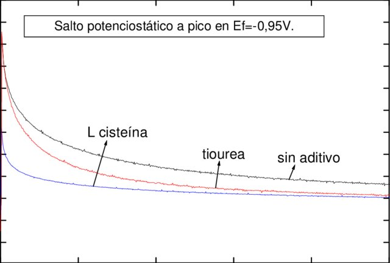
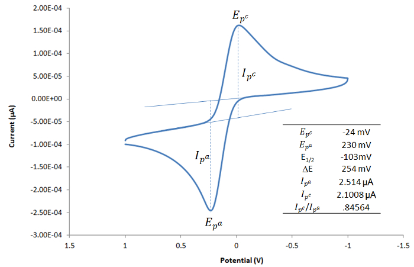
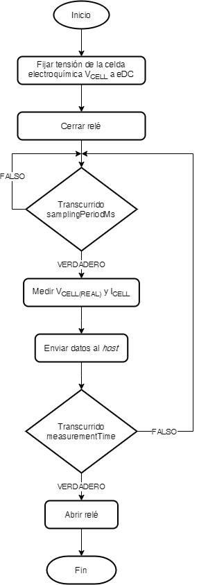
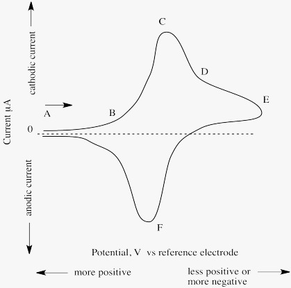
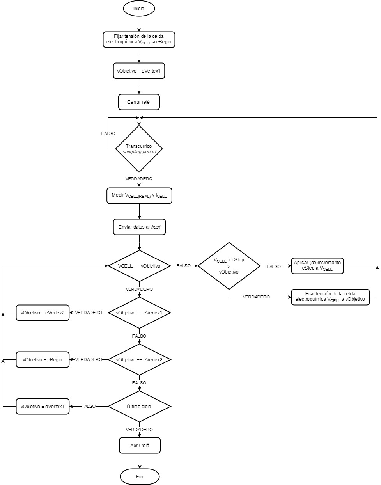
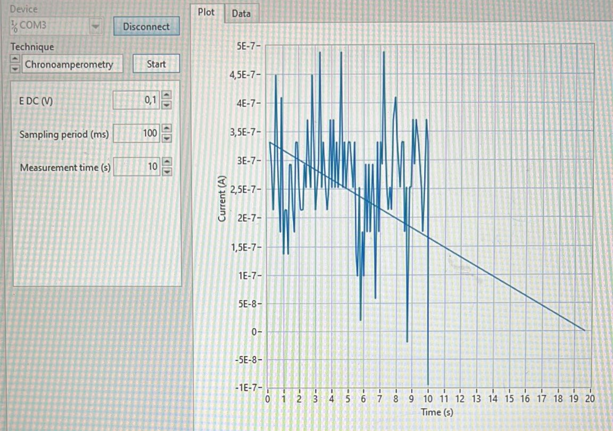

# **Proyecto Final Microcontroladores: Potenciostato**

    

Este proyecto ha sido desarrollado durante el curso 2022-2023 en el Grado en Ingeniería Biomédica de la Universidad de Barcelona (UB) en la asignatura optativa Microcontroladores para Aplicaciones y Sistemas Biomédicos. El proyecto ha sido realizado por el grupo **_Biominds_** formado por Marc Florido, Isabel Martín  y Adrià Pladevall, junto con la tutorización durante el proyecto por parte del profesor Albert Álvarez Caeulla, al cual estamos agradecidos por su ayuda en el trabajo. 

    
    
    

> **Figura 1. Marc Florido (izquierda), Isabel Martín (centro), y Adrià Pladevall (derecha), autores del proyecto desarrollado.**

A continuación se adjunta toda la información referente al proyecto desarrollado, el cual consiste en la programación de un potenciostato para llevar a cabo mediciones electroquímicas. Se incluyen todos los resultados obtenidos durante el proyecto, así como una explicación de cómo se ha trabajado en equipo para lograr los objetivos utilizando control de versiones Git en diferentes ramas.

## **Tabla de Contenidos**

- [Introducción](#introducción)
  - [Potenciostato](#potenciostato) 
  - [Cronoamperometría](#cronoamperometría) 
  - [Voltametría cíclica](#voltametría-cíclica) 
- [Objetivos del proyecto](#objetivos-del-proyecto)
- [Software y Hardware](#software-y-hardware)
- [*Workflow* en Git](#workflow-en-git)
- [Método](#método)
  - [Organización](#organización)
  - [Aplicación](#aplicación)
  - [Microcontrolador](#microcontrolador)
  - [Cronoamperometría](#cronoamperometría)
  - [Voltametría cíclica](#voltametría-ciclica)

- [Resultados](#resultados)
  - [Cronoamperometría resultados prueba](#cronoamperometría-resultados-prueba)
  - [Cronoamperometría resultados experimentales](#cronoamperometría-resultados-experimentales)
  - [Voltametría cíclica resultados prueba](#voltametría-cíclica-resultados-prueba)
  - [Voltametría cíclica resultados experimentales](#voltametría-cíclica-resultados-experimentales)

- [Conclusiones](#conclusiones)
- [Referencias](#referencias)

## **Introducción**
En este proyecto, se llevará a cabo la programación de un potenciostato. El potenciostato consta de dos componentes principales: un front-end diseñado específicamente para este proyecto y un back-end basado en la placa Evaluation Board (EVB) NUCLEO-F401RE de _STMicroelectronics_. 

El objetivo principal del proyecto consiste en lograr la capacidad de realizar dos tipos de mediciones electroquímicas: voltametría cíclica y cronoamperometría. Para validar el funcionamiento del dispositivo, se llevarán a cabo mediciones utilizando una muestra de ferricianuro de potasio a diferentes concentraciones en un tampón o solución de cloruro de potasio.

### **Potenciostato**
Un potenciostato es un instrumento electrónico utilizado en estudios electroquímicos para medir y controlar la diferencia de voltaje de una celda de tres electrodos.

El sistema fucniona manteniendo el potencial del electrodo de trabajo (WE) a un nivel constante con respecto al potencial del electrodo de referencia (RE) mediante el ajuste de la corriente en un electrodo auxiliar (CE). Se trata de un cricuito eléctrico, que se describe generalmente en forma de simples Op Amps, como se puede apreciar en la Figura 2. Ene electrodo de trabajo es donde tiene lugar la reacción electroquímica con el cual el electrodo de referencia es capaz de medir el potencial generado en el electrodo de referencia. [1]

    

> **Figura 2. Esquema de un potenciostato.**

### **Cronoamperometría**
La cronoamperometría es una técnica electroquímica que consiste en aplicar un potencial escalonado a través del electrodo de trabajo. Esto provoca reacciones de oxidación o reducción en la solución en el electrodo, y la corriente electroquímica resultante se mide a lo largo del tiempo después de aplicar el paso de potencial. [2]

En la cronoamperometría, se aplica un potencial de onda cuadrada al electrodo de trabajo y se controla la corriente resultante en función del tiempo. La corriente fluctúa a medida que el analito se difunde desde la solución a granel hacia la superficie del sensor. Al estudiar la dependencia corriente-tiempo, la cronoamperometría permite medir los procesos controlados por difusión en un electrodo, que varían con la concentración de analito. Esta técnica es muy sensible y no requiere marcar el analito o el biorreceptor. [3]

La cronoamperometría se ha utilizado ampliamente en diversos estudios, ya sea de forma independiente o en combinación con otras técnicas electroquímicas como la voltamperometría cíclica. Por ejemplo, Martins et al. emplearon la cronoamperometría para investigar la adsorción de albúmina sérica humana en monocapas autoensambladas (SAM) sobre sustratos de oro. [2]

    

> __Figura 3. Cronoamperometría desde el potencial inicial Ei hasta-0,95 V (zona del pico c 1 de la voltametría), en presencia o ausencia de aditivo: a. sin aditivo; b. con tiourea 5·10^-4 M; c. l-cisteína 5·10^-4 M. [4]__

### **Voltametría cíclica**

La voltametría cíclica es un método esencial en electroquímica para medir el potencial de reducción de especies químicas en solución. Aplicando un voltaje controlado y registrando la corriente resultante, se obtiene información sobre las reacciones de reducción/oxidación y la estabilidad de las especies involucradas en la transferencia de electrones. Esta técnica, también conocida como voltamperometría cíclica (CV), permite explorar catalizadores y compuestos electroquímicos con mayor profundidad. Su combinación con el modelado y enfoques sistemáticos ahorra tiempo y es útil para investigadores con acceso limitado a instrumentación electroquímica. [5,6]

La voltametría cíclica es un experimento que consiste en explorar una variedad de voltajes mientras se mide la corriente. En este experimento, se varía el potencial de un electrodo desde un valor inicial hasta uno final y luego se invierte el proceso. Esto genera un barrido "cíclico" de voltajes y la representación gráfica de corriente versus voltaje se llama voltamperograma cíclico. Los voltamperogramas proporcionan información sobre la estabilidad de los estados de oxidación, la reversibilidad de las reacciones de transferencia de electrones y la reactividad de las especies. Este video explica la configuración básica y muestra un experimento simple de voltametría cíclica. [7]

    

> __Figura 4. Voltametría Cíclica: Measuring Redox Potentials and Currents. [7]__

## **Objetivos del proyecto**

El objetivo principales obtener medidas de concentración en muestras electroquímicas utilizando técnicas de voltametría cíclica y cronoamperometría en muestras de ferricianuro de potasio a diferentes concentraciones en un buffer de cloruro de potasio, asegurando la correcta programación y comunicación del potenciostato utilizando la placa STM-32 Núcleo 64.

Además, tiene el objetivo secundario de controlar la unidad de alimentación (PMU)del módulo front-end del potenciostato y comunicarse con la aplicación viSens-S utilizando el protocolo MASB-COMM-s. Finalmente, deben cumplir con los requisitos específicos, como el inicio y la no deshabilitación de la PMU y la comunicación asíncrona con el host.

## __Software y Hardware__

La programación del microcontrolador es de vital importancia en el contexto del proyecto, ya que desempeña un papel crucial en la comunicación y control del potenciostato, así como en la recepción y envío de instrucciones y datos relevantes. Para llevar a cabo esta tarea, se ha utilizado la placa STM32 Nucleo-F401RE. La programación de dicho microcontrolador se ha realizado utilizando el software STM32CubeIDE, en lenguaje C.

El proyecto tiene otro componente de _software_ que es la aplicación _viSens-S_, que se encuentra disponible en un enlace. Esta aplicación tiene la función de seleccionar el puerto donde la placa está conectada, seleccionar la técnica a realizar (cronoamperometria o voltametria ciclica), escoger diferentes parámetros, y enviar las instrucciones necesarias para realizar las mediciones, y finalmente recibir y visualizar los datos correspondientes. 

## __*Workflow* en Git__
Git es el Sistema de Control de Versiones (VCS) más utilizado del mundo para el desarrollo de software. Este sistema permite el seguimiento de cambios en el código y la colaboración entre diferentes desarrolladores. Esto permite la recuperación de versiones anteriores Git permite la creación de ramas para trabajar individualmente sin afectar la rama principal.

Además, hemos utilizado GitHub que es una plataforma de desarrollo de software en la nube que permite alojar, compartir y colaborar en repositorios utilizando el sistema de control de versiones Git. La platforma permite a los desarrolladores trabajar en equipo detectando cambios y manteniendo un historial de versiones. 

En Git, se utilizan diferentes ramas para organizar el desarrollo del código. La rama ``master`` es donde se encuentra el código de producción, es decir, el código que está listo para ser entregado al cliente y funciona correctamente.

Por otro lado, la rama `develop` es utilizada como la rama principal de desarrollo. Aquí es donde se agrupan todos los desarrollos realizados por el equipo y se llevan a cabo las pruebas necesarias. Una vez que se verifica que todo funciona correctamente, los cambios se fusionan en la rama "master" mediante un Pull Request para que estén disponibles para el cliente.

Además, se utilizan las ramas `feature/***` para trabajar en el desarrollo de funcionalidades específicas. Cada una de estas ramas contiene el trabajo individual o conjunto relacionado con una determinada funcionalidad. Después de que estas ramas han sido probadas y se ha verificado su correcto funcionamiento, se fusionan en la rama ``develop`` mediante un Pull Request.

El repositorio seguirá el árbol de ramas indicado en la Figura 5. 

    

> __Figura 5. Git Tree para este repositorio.__

## __Método__ 
### __Organización__

Este proyecto ha sido organizado en diferentes ramas `feature/***`, cada una creada con el objetivo de editar una parte en específico del proyecto, concretamente para crear las diferentes funciones que se necesitan para implementar la cronoamperometría y la voltametría. 

Las siguientes ramas se crearon: 

- `feature/PMU`: Para crear las funciones de apagado y encendido de la PMU. 
- `feature/adc`: Para crear las funciones del inicio o finalización de la ADC para capturar el voltage y la corriente. 
- `feature/command_handler`: Para editar todo lo relativo al archivo stm32main.c. 
- `feature/rele`: Para crear las funciones para abrir o cerrar el relé. 
- `feature/timers `: Para crear las funciones que inician los timers y la función de interrupción ISR que se ejecuta cuando ha transcurrido el periodo de medida. 
- `feature/chronoamperometry`: Para crear la función de cronoamperometría que realizará la medición. 
- `feature/cyclic_voltammetry_correct`: Para crear la función de voltametría que realizará la medición. 
- `feature/command_handler`: Para desarrollar el archivo stm32main.c que contiene la función setup y loop para configurar, inicializar y manejar comandos recividos a través de MASB_COMM_S para ejecutar una voltametría o una cronoamperometría. 

### __Aplicación__

> **Figura 6. Workflow de la aplicación**

En la implementación del flujo de trabajo que se observa en la Figura 1, se requieren elementos clave para facilitar la comunicación asíncrona entre un dispositivo y una aplicación de escritorio. Estos elementos incluyen la comunicación USART, la codificación COBS y el protocolo MASB-COMM-S.

La comunicación asíncrona mediante USART es crucial para establecer una conexión serial entre el dispositivo y la aplicación de escritorio. Permite la transmisión y recepción de datos de manera independiente, lo que implica que tanto el dispositivo como la aplicación pueden enviar y recibir información en cualquier momento sin tener que esperar una respuesta inmediata.

Para garantizar una comunicación confiable y sin errores, se utiliza la codificación COBS. Esta técnica codifica y decodifica la información transmitida entre el dispositivo y la aplicación; como se ha visto en prácticas anteriores de la asignatura de Microcontroladores.  

Además, se emplea el protocolo MASB-COMM-S, el cual desempeña un papel importante en la implementación. El archivo cobs.c se encarga específicamente de la codificación y decodificación de la información, mientras que el archivo masb_comm_s.c se encarga de configurar la comunicación asíncrona. Este último también se encarga de recibir y leer instrucciones de medición, almacenando los parámetros correspondientes en las estructuras adecuadas. Asimismo, se encarga de transmitir los datos obtenidos.

### __Microcontrolador__

> **Figura 7. Workflow del funcionamiento del microcontrolador**

El archivo "stm32main.c" contiene la implementación de las funciones "setup" y "loop", que son llamadas por el archivo principal "main.c", prime archivo que se ejecuta. Estas funciones se dedican a configurar y controlar el dispositivo en función de los comandos recibidos a través de la comunicación asíncrona utilizando el protocolo MASB-COMM-S.

En la función "setup", se realizan las siguientes tareas:

- Se espera la recepción de un mensaje mediante la función "MASB_COMM_S_waitForMessage()".

- Se inicializa la comunicación I2C llamando a la función "I2C_init()" y se configura el objeto "hi2c1" que representa el controlador I2C.
- Se enciende el módulo de administración de energía (PMU) llamando a la función "Start_PMU()".
- Se inicializa el convertidor digital-analógico (DAC) utilizando la función "MCP4725_Init()". Se configuran parámetros como la dirección del esclavo, la tensión de referencia y la función de escritura.
- Se inicializa el potenciómetro digital (AD5280) utilizando la función "AD5280_Init()". Se configura la dirección del esclavo, el valor nominal de resistencia y la función de escritura.
- Se fija la resistencia del potenciómetro en 50 kohms llamando a "AD5280_SetWBResistance()".
- Se establece el estado inicial del dispositivo como "IDLE".

En la función "loop", se realiza el bucle principal del programa. 

- Primero, se verifica si se ha recibido un mensaje llamando a la función "MASB_COMM_S_dataReceived()". Si se ha recibido un mensaje, se analiza el comando recibido utilizando "MASB_COMM_S_command()". Dependiendo del comando recibido ("START_CV_MEAS", "START_CA_MEAS" o "STOP_MEAS"), se actualiza el estado del dispositivo ("CV", "CA", "IDLE") y se almacenan las configuraciones correspondientes. Este estado recibido dependerá de la medición que queremos hacer. Si no se ha recibido ningún mensaje, el código verifica el estado actual del dispositivo. 
- Si el estado es "CV" (cyclic voltammetry) o "CA" (chronoamperometry), se ejecutan las funciones "cyclic_voltammetry()" o "chronoamperometry()" respectivamente, utilizando las configuraciones almacenadas previamente. 

### __Cronoamperometría__

#### __Concepto__

Como se ha comentado anteriormente, la cronoamperometría es una técnica electroquímica utilizada para estudiar reacciones redox y medir la corriente eléctrica generada durante dichas reacciones en función del tiempo. Se basa en la aplicación de un potencial constante a través de una celda electroquímica y la medición de la corriente resultante a medida que la reacción se desarrolla en el electrodo.

La implementación de la cronoamperometría se hace en el archivo llamado "chronoamperometry.c". Esta función se encarga de realizar mediciones de cronoamperometría según la configuración dada por el guión de prácticas.

#### __Implementación__

El código implementa una función llamada "chronoamperometry" que realiza una medición de cronoamperometría. Esta función sigue el diagrama de flujo que muestra la **Figura 8**. 

En resumen, primero se configuran los componentes necesarios, se inicia un temporizador y un relé, y luego se realizan mediciones periódicas de corriente y voltaje durante un tiempo determinado. En cada intervalo de tiempo, se realiza una conversión analógico-digital (ADC) para obtener los valores medidos. A partir de estos valores, se calculan la corriente y el voltaje reales. Estos datos se almacenan en una estructura y se envían a través de una función de comunicación. Al finalizar el tiempo de medición, se cierra el relé y se detiene el temporizador. 

A continuación se detalla el funcionamiento de la función así como algunas variables usadas.

Primeramente, se debe tener en cuenta que la función "chronoamperometry" toma como parámetro una estructura "CA_Configuration_S" que contiene la configuración necesaria para la medición de cronoamperometría. Dentro de la función, se realizan las siguientes acciones:

- Se establece la salida de voltaje del DAC utilizando la función `MCP4725_SetOutputVoltage`. Se calcula el voltaje de salida necesario mediante la función `calculateDacOutputVoltage` a partir del valor de corriente continua (eDC) especificado en la configuración.
- Se inicia el rele mediante la función `Start_Rele` para permitir la conexión de los electrodos y comenzar la medición.
- Se inicia un temporizador utilizando la función `Start_Timer` con el período de muestreo especificado en la configuración.
- Se inicializan las variables `EllapsedTime` (tiempo transcurrido) y `counter_data` (contador de datos).
- Se entra en un bucle mientras el tiempo transcurrido sea menor que el tiempo de medición especificado en la configuración.
- Dentro del bucle, se verifica si ha transcurrido el tiempo de muestreo utilizando la función `TimeoutEllapsed`. Si es así, se actualiza el tiempo transcurrido, se inicia la conversión analógico-digital (ADC) mediante la función `ADC_Start` y se obtienen los valores de voltaje y corriente mediante las funciones `ADC_get_Voltage` y `ADC_get_Current` respectivamente. Estos valores se convierten a las unidades apropiadas utilizando funciones como `calculateIcellCurrent` y `calculateVrefVoltage`.
- Se detiene la conversión ADC llamando a `ADC_Stop`.
- Se crea una estructura `Data_S` que contiene la información del punto de medición, tiempo transcurrido, corriente y voltaje.
- Se envía la estructura de datos utilizando la función `MASB_COMM_S_sendData` para su posterior transmisión a la aplicación de escritorio.
- Se borra el temporizador llamando a `ClearTimeout`.
- Se cierra el rele mediante la función `Close_Rele` para detener la medición.
- Se detiene el temporizador utilizando la función `Stop_Timer`.

> **Figura 8. Workflow cronoamperometría**

### __Voltametría cíclica__

#### __Concepto__

La voltametría cíclica es una técnica ampliamente empleada para evaluar el potencial de reducción de una especie disuelta. Mediante este método, se obtienen datos adicionales que permiten analizar la reacción de reducción/oxidación y la estabilidad de las especies involucradas en la transferencia de electrones. En la voltametría cíclica, se aplica un voltaje a la solución y se registra la corriente a medida que el voltaje cambia en el tiempo. Cuando el voltaje alcanza un nivel que induce una reacción de reducción/oxidación, la corriente comienza a fluir. 

Esta técnica implica el barrido de voltaje entre dos vértices, comenzando desde un extremo y luego regresando al otro. El barrido se puede repetir varios ciclos. El resultado es un voltamograma cíclico, que representa una representación gráfica de la corriente en función del voltaje aplicado, tal y como podemos observar en la siguiente figura. 

    

> **Figura 9. Voltametría gráfico**

#### __Implementación__ 

El proceso de voltametría cíclica se lleva a cabo mediante el siguiente flujo de ejecución. Primero, se utilizan los componentes ADC y DAC para medir y ajustar los voltajes necesarios en el sistema. El programa va verificando constantemente si los ciclos establecidos para la medición no han finalizado y si se ha alcanzado el período de muestreo. En primer lugar, se verifica si el voltaje actual ha llegado a alguno de los vértices definidos en la configuración. Si es así, se establece el siguiente vértice como objetivo para el voltaje a aplicar en la celda. Esto asegura que el barrido se realice entre los vértices establecidos, siguiendo un patrón predefinido. Si el voltaje actual no ha alcanzado ningún vértice, se procede a ajustar el voltaje de la celda. Dependiendo del vértice actual, se aplica un incremento o decremento controlado al voltaje actual hasta que se alcance el objetivo establecido. Este proceso se repite hasta que se cumplan las condiciones de los vértices y se complete el número de ciclos especificados.

    

> **Figura 10. Workflow voltametría**

## __Resultados__

### __Cronoamperometría resultados prueba__

Para comprobar que el código para realizar la cronoamperometría funcionaba bien, se hicieron varias pruebas probando con diferentes valores de eDC, sampling period y measurement time de la aplicación viSens. La **Figura 11** muestra el resultado del gráfico corriente vs tiempo con los valores de eDC = 0.6, Sampling period = 100 y Measurement time = 10. 

> **Figura 11. Resultados amperometría prueba**

Al realizar la cronoamperometría se esperaba que el gráfico corriente vs tiempo fuera una línea recta horizontal debido a que como que no hay ninguna reacción electroquímica ocurriendo en el electrodo, la corriente debería mentenerse constante a lo largo del tiempo. En la **Figura 11** observamos como varia y no se mantiene constante. Esto puede ser debido a ruido, ya que no se encontró ningún otro fallo en el código implementado. 

### __Cronoamperometría resultados experimentales__

Posteriormente, se ejecutó la cronoamperometría de nuevo cuando se llevo a cabo la reacción electroquímica. Esta medición se hizó después de la voltametría. La voltametría en principio debería haber oxidado el componente. Sin embargo, esto no ocurrió debido a que la voltametría no funcionó correctamente (véase el siguiente apartado). 

Los resultados experimentales de la cronoamperometría son los siguientes: 

> **Figura 12. Resultados amperometría experimental**

Se observa en el gráfico como la corriente cambia a lo largo del tiempo. Se muestran picos abruptos en la corriente que indican reacciones rápidas durante el proceso electroquímico. Sin embargo, si la voltametría hubiera funcionado correctamente, primeramente se observaría un incremento con gran pendiente de la corriente debido a la oxidación, tal y como se comentó en clase. 

### __Voltametría cíclica resultados prueba__

Al realizar la voltametría cíclica con el circuito diseñado, esperábamos obtener un barrido lineal entre los puntos de voltaje evetex1 y evetex2. En este barrido, se esperaba observar una recta con pendiente positiva, lo que indicaría un aumento gradual de la corriente a medida que el potencial se incrementa.

Sin embargo, los resultados obtenidos mostraron una recta con pendiente negativa en lugar de positiva. Esto significa que la corriente disminuye a medida que el potencial aumenta. Este comportamiento inesperado puede indicar la presencia de algún factor que está afectando el sistema. La recta con pendiente negativa en el voltamograma cíclico refleja cómo la intensidad de corriente cambia en respuesta a los diferentes potenciales aplicados, siguiendo la ley de Ohm.

### __Voltametría cíclica resultados experimentales__

Al realizar la voltametría cíclica con las soluciones en clase, el voltaje fue inicializado en 0.7 V y los dos vértices en 0.8 y -0.1 V, respectivamente. Se determinarion 4 ciclos, con una variación de 0.1 V/s y un incremento de 0.01 V entre los puntos consecutivos. 

Los resultados obtenidos se representaron en una gráfica, y se pudo observar que no siguieron la forma esperada. Los resultados obtenidos no son satisfactorios, ya que mostraron el mismo patrón que se observó en la prueba anterior.

    

**Figura 13. Resultados voltametría experimetal**

## Conclusiones

El proyecto final ha consistido en el desarrollo de un potenciostato programado para llevar a cabo mediciones electroquímicas utilizando técnicas de cronoamperometría y voltametría cíclica. El objetivo principal fue obtener medidas de concentración en muestras electroquímicas utilizando el potenciostato y la placa STM32 Nucleo-F401RE. Se implementaron las técnicas de cronoamperometría y voltametría cíclica para realizar mediciones electroquímicas en una muestra de ferricianuro de potasio a diferentes concentraciones en un tampón de cloruro de potasio.

La programación del microcontrolador se realizó utilizando el software STM32CubeIDE en lenguaje C. Además, se utilizó la aplicación viSens-S para seleccionar el puerto de conexión, elegir la técnica de medición y enviar instrucciones al potenciostato.

El proyecto se organizó utilizando ramas específicas en Git, como `feature/PMU`, `feature/adc`, `feature/rele`, `feature/timers`, `feature/chronoamperometry` y `feature/cyclic_voltammetry_correct`, para desarrollar las diferentes funcionalidades del potenciostato.

Puede decirse que el código ha sido correctamente debugeado y no tiene ningún problema de ejecución. Sin embargo, se ha visto que la implementación de la voltametría cíclica no es del todo correcta puesto que no da los resultados esperados. Esto ha perjudicado también en cierto modo a los resultados de la cronoamperometría. 

No obstante, se considera que este proyecto ha sido de gran utilidad en cuanto a aprender a programar en equipo mediante el uso de diferentes ramas de git. 

## **Referencias**
[1] Wikipedia. (2023). _Potenciostato_. https://es.wikipedia.org/wiki/Potenciostato

[2] Guy, O. J., & Walker, K. D. (2016). Graphene Functionalization for Biosensor Applications. In Elsevier eBooks (pp. 85–141). https://doi.org/10.1016/b978-0-12-802993-0.00004-6

[3] Ghosh, G. (2023). Graphene oxide-nanocomposite-based electrochemical sensors for the detection of organophosphate pesticides. In Elsevier eBooks (pp. 635–658). https://doi.org/10.1016/b978-0-323-90553-4.00009-3

[4] Mahmud, Z. Á., Gordillo, G., & D´Alkaine, C. V. (2017). Efecto del aditivo l-cisteína en la electrodeposición de cinc en medio ácido. . . ResearchGate. https://www.researchgate.net/publication/317021719_Efecto_del_aditivo_l-cisteina_en_la_electrodeposicion_de_cinc_en_medio_acido_httpwww-bibliointigobartrabintiMahmudGordillo10pdf/figures?lo=1

[5] Libretexts. (2022). 1.11: Voltamperometría cíclica. LibreTexts Español. https://espanol.libretexts.org/Quimica/Qu%C3%ADmica_General/Estructura_y_Reactividad_en_Qu%C3%ADmica_Org%C3%A1nica%2C_Biol%C3%B3gica_e_Inorg%C3%A1nica_V%3A_Reactividad_en_Qu%C3%ADmica_Org%C3%A1nica%2C_Biol%C3%B3gica_e_Inorg%C3%A1nica_3/01%3A_Reacciones_de_Reducci%C3%B3n_y_Oxidaci%C3%B3n/1.11%3A_Voltamperometr%C3%ADa_c%C3%ADclica

[6] Voltametría cíclica (CV): la técnica analítica esencial para la investigación de catalizadores. (2022, August 26). Metrohm. https://www.metrohm.com/es_es/discover/blog/20-21/cyclic-voltammetry--cv----the-essential-analytical-technique-for.html

[7] Bard, A. J., Faulkner, L. A. Electrochemical methods: Fundamentals and Applications. 2nd ed. New York: Wiley; 833 p. (2001).

